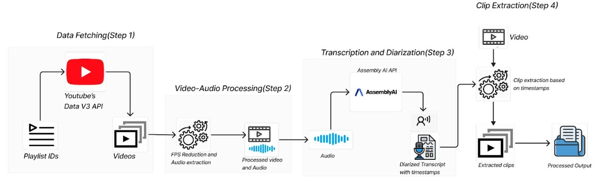
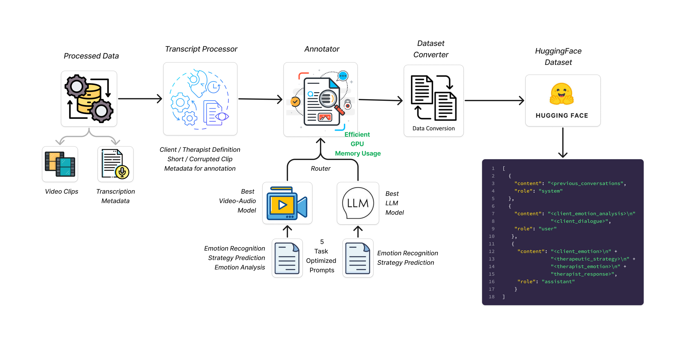
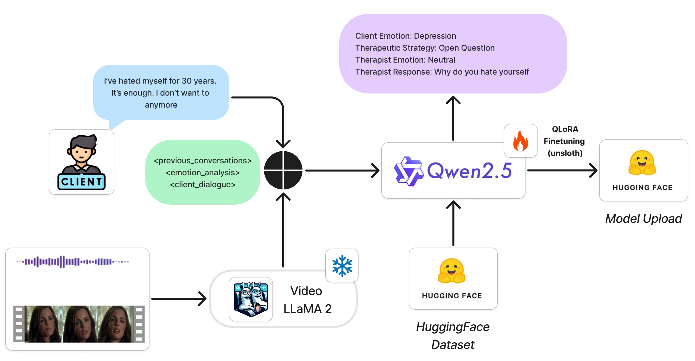

# AI Therapist

The repository consists of the code for the dataset preparation and model training of the AI therapist.

## Repository Structure
```
.
├── dataset/
│   ├── annotation/
│   │   ├── tmp/
│   │   ├── __init__.py
│   │   ├── annotate.py
│   │   ├── annotation_engine.py
│   │   ├── constants.py
│   │   ├── logger.py
│   │   ├── postprocessor.py
│   │   ├── preprocessor.py
│   │   └── prompts.py
│   └── extraction/
│       ├── __init__.py
│       ├── constants.py
│       ├── data_uploader.py
│       ├── extract.py
│       └── video_processor.py
|── model/
|   ├── eval/
|   │   └── evaluator.py
|   ├── fine-tuning/
|   │   ├── config.py
|   │   ├── finetune.py
|   │   ├── hf.py
|   │   └── utils.py
|   ├── inference.py
|── videollama2/
├── .gitignore
├── LICENSE
├── README.md
└── requirements.txt
```
**Note:** The `videollama2` folder is borrowed from [VideoLLaMA2](https://github.com/DAMO-NLP-SG/VideoLLaMA2) repository with necessary modifications for finetuning and inference purposes.

## Installation Guide

### 1. Dependencies Installation

#### On Linux
Run the following commands to update the package list and install the required system dependencies:
```bash
sudo apt-get update
sudo apt-get install ffmpeg libsm6 libxext6 -y
```

#### On Windows
You have two options to install FFmpeg:

Option 1 - Using Chocolatey:
1. Install [Chocolatey](https://chocolatey.org/install) (if not already installed)
2. Run in Administrator Command Prompt or PowerShell:
```powershell
choco install ffmpeg
```

Option 2 - Using Windows Package Manager:
```bash
winget install ffmpeg
```

Note: The libraries `libsm6` and `libxext6` are typically not required on Windows. If your application specifically needs equivalent functionality, consult your library's documentation for Windows-compatible alternatives.

### 2. Virtual Environment Setup

#### On Linux
```bash
# Create a new virtual environment
python -m venv venv

# Activate the virtual environment
source venv/bin/activate
```

#### On Windows
```powershell
# Create a new virtual environment
python -m venv venv

# Activate the virtual environment
.\venv\Scripts\activate
```

### 3. Python Dependencies
Install all required Python packages by running:
```bash
pip install -r requirements.txt
```

### 4. Environment Setup
Create a `.env` file in the root directory of the project with the following configurations:
```env
LOCATION=<your-gcp-location>
PROJECT_ID=<your-gcp-project-id>
MODEL_NAME=<your-model-name>
DATA_BUCKET_NAME=<your-gcp-bucket-name>
DATA_REPO_NAME=<your-huggingface-dataset-repo>
MODEL_REPO_NAME=<your-huggingface-model-repo>
HF_TOKEN=<your-huggingface-token>
YOUTUBE_API_KEY=<your-youtube-api-key>
ASSEMBLYAI_API_KEY=<your-assemblyai-api-key>
```

**Note:** Replace all placeholder values (enclosed in `<>`) with your actual credentials and configuration values.

## Data Extraction Pipeline



The data extraction pipeline processes therapy session videos through several stages to prepare them for data annotation. Run the following command to execute the pipeline:

```bash
python -m dataset/extraction/extract.py
```

The pipeline performs the following operations:

1. **Data Retrieval:**
   - Retrieves video IDs from curated YouTube playlists
   - Validates and stores IDs locally to avoid redundant API calls
   - Downloads the corresponding videos systematically

2. **Video Processing:**
   - Standardizes videos to 16 FPS for uniform temporal resolution
   - Re-encodes videos to ensure clean extraction from keyframe intervals
   - Prevents video corruption during clip extraction

3. **Audio Processing:**
   - Extracts audio content from standardized videos
   - Optimizes audio files for transcription
   - Implements checks to avoid redundant processing

4. **Transcription:**
   - Generates detailed transcriptions with speaker diarization
   - Provides precise start and end timestamps for each speech segment
   - Outputs both human-readable text and structured JSON formats

5. **Video Segmentation:**
   - Creates meaningful clips aligned with speech content
   - Enforces minimum duration threshold (>3 seconds)
   - Organizes clips in structured directories by video

## Data Annotation Pipeline


⚠️ **Important:** Running the annotation engine locally requires a GPU with atleast 48GB memory (e.g., A100 or L40S) if using local models. CPU-only execution is possible when using cloud API endpoints.

Run the following command to execute the annotation pipeline:

```bash
python -m dataset/annotation/annotation_engine.py
```

The annotation pipeline performs the following operations:

1. **Preprocessing:**
   - Implements comprehensive video analysis using FFprobe
   - Detects video corruption and validates stream integrity
   - Checks frame rates and dimensional validity
   - Manages both local and Google Cloud Storage paths

2. **Multi-Modal Model Architecture:**
   - Primary: Google's Gemini 1.5 Flash (gemini-1.5-flash-002)
   - Fallback Local Setup (requires 48GB GPU):
     - Video-Audio Processing: VideoLLaMA2-7B (DAMO-NLP-SG/VideoLLaMA2-7B-16F)
     - Text Analysis: Meta's LLaMA 3.1 8B Instruct

3. **Emotion and Strategy Detection:**
   - Emotions: Identifies 7 states (anger, sadness, disgust, depression, neutral, joy, fear)
   - Therapeutic Strategies: Recognizes 10 approaches (open questions, approval, self-disclosure, etc.)
   - Role-aware prompting optimized for therapy context

4. **Intelligent Processing:**
   - Routes between VideoLLaMA and LLaMA based on clip characteristics
   - Implements dynamic model loading and lazy initialization
   - Maintains separate queues for text and video processing
   - Defaults to text-only processing for corrupted or short clips (<3 seconds)

5. **Data Management:**
   - Implements error handling with exponential backoff
   - Maintains conversation context through sliding windows
   - Creates train-validation-test splits preserving conversation integrity
   - Uploads structured dataset to HuggingFace

## Model Fine-tuning


⚠️ **Important:** Model fine-tuning requires a GPU with at least 16GB memory.

Run the following command to execute the fine-tuning process:

```bash
python -m model/fine-tuning/finetune.py
```

### Architecture and Fine-tuning Process

1. **Multi-Modal Architecture:**
   - Processes therapy sessions through integrated video, audio, and text inputs
   - Uses VideoLLaMA 2 as the base vision-language model
   - Captures both verbal and non-verbal communication cues
   - Feeds processed multi-modal input into Qwen2.5-7B

2. **QLoRA Fine-tuning Configuration:**
   - Base Model: Qwen2.5-7B-Instruct
   - Method: Low-Rank Adaptation (LoRA) with 4-bit quantization
   - Maximum sequence length: 2048 tokens
   - LoRA rank and alpha: 16
   - Training Parameters:
     - Optimizer: AdamW 8-bit
     - Learning rate: 2e-4
     - Batch size: 2
     - Gradient accumulation steps: 4
   - Training Scale:
     - Steps: 166
     - Examples processed: 1,329
     - Epochs: 1

3. **Key Features:**
   - Integrated approach vs sequential processing
   - End-to-end pattern learning in therapeutic conversations
   - Efficient adaptation while maintaining performance
   - Continuous model improvement through HuggingFace integration
   - Streamlined pipeline combining VideoLLaMA 2 and Qwen2.5-7B